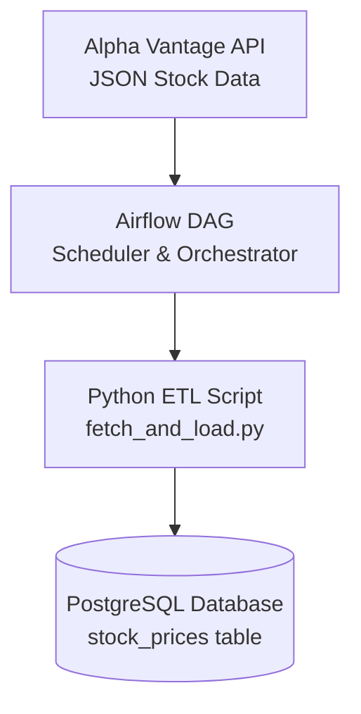

# 🚀 Dockerized Stock Market ETL Pipeline

*Automated end-to-end ETL pipeline using Airflow, Python, PostgreSQL & Docker*

<p align="center">
  
  
  
  
  
  
</p>

---

## 📚 Table of Contents

* [📘 Overview](#-overview)
* [🏗 Architecture](#-architecture)
* [📁 Project Structure](#-project-structure)
* [🛠️ Tech Stack](#️-tech-stack)
* [🔑 Environment Variables](#-environment-variables)
* [▶️ How to Run the Pipeline](#️-how-to-run-the-pipeline)
* [🗄 Database Table](#-database-table)
* [🐍 ETL Logic](#-etl-logic)
* [⚠️ Error Handling & Robustness](#️-error-handling--robustness)
* [⏱ Airflow DAG Scheduling](#-airflow-dag-scheduling)
* [🐳 Docker Services](#-docker-services)
* [🚀 Optional Enhancements](#-optional-enhancements)
* [📸 Screenshots (Optional)](#-screenshots-optional)
* [✅ Assignment Requirements Checklist](#-assignment-requirements-checklist)

---

# 📘 Overview

This project implements a **Dockerized data pipeline** using:

* **Apache Airflow** for workflow orchestration
* **Python** for extraction & transformation
* **PostgreSQL** for persistent storage
* **Docker Compose** for containerized setup

The goal is to fetch **daily stock prices** from the **Alpha Vantage API**, parse the JSON response, and load it into a PostgreSQL database — all orchestrated via Airflow.

This fulfills all assignment requirements, including:
✔ API extraction
✔ JSON parsing
✔ Database loading
✔ Error handling
✔ Docker & Airflow orchestration
✔ Environment variable–based configuration
✔ Clean GitHub-ready project structure

---

# 🏗 Architecture



---

# 📁 Project Structure

```
.
├── docker-compose.yml
├── .env.example
├── README.md
├── airflow/
│   ├── dags/
│   │   └── stock_pipeline_dag.py
│   └── requirements.txt
├── scripts/
│   └── fetch_and_load.py
└── sql/
    └── init.sql
```

### Folder Description

| File/Folder                 | Description                          |
| --------------------------- | ------------------------------------ |
| `docker-compose.yml`        | Runs Airflow + PostgreSQL containers |
| `airflow/dags/*.py`         | Airflow DAG definition               |
| `scripts/fetch_and_load.py` | Python ETL logic                     |
| `sql/init.sql`              | SQL script to auto-create table      |
| `.env.example`              | Template for environment variables   |
| `README.md`                 | Project documentation                |

---

# 🛠️ Tech Stack

* **Python 3.10+**
* **Apache Airflow 2.9.0**
* **Docker & Docker Compose**
* **PostgreSQL 16**
* **Alpha Vantage API**

---

# 🔑 Environment Variables

Create `.env` based on `.env.example`

```env
POSTGRES_DB=stocksdb
POSTGRES_USER=stocksuser
POSTGRES_PASSWORD=stockspass
POSTGRES_HOST=postgres
POSTGRES_PORT=5432

AIRFLOW__CORE__LOAD_EXAMPLES=False

ALPHA_VANTAGE_API_KEY=YOUR_API_KEY_HERE
STOCK_SYMBOL=AAPL
```

⚠️ **Never commit your real `.env` to GitHub.**

---

# ▶️ How to Run the Pipeline

### **1️⃣ Clone the Repository**

```bash
git clone <your-repo-url>
cd docker-airflow-stock-pipeline
```

### **2️⃣ Create `.env` File**

```bash
cp .env.example .env
```

Add your real API key.

### **3️⃣ Start Docker**

```bash
docker compose up --build
```

### **4️⃣ Access Airflow UI**

Open:
👉 [http://localhost:8080](http://localhost:8080)

Login:

```
username: admin
password: admin
```

### **5️⃣ Trigger ETL Pipeline**

1. Enable DAG: `stock_data_pipeline`
2. Click **Trigger DAG**

---

# 🗄 Database Table

Created automatically using `sql/init.sql`:

| Column     | Type                    |
| ---------- | ----------------------- |
| id         | SERIAL PRIMARY KEY      |
| symbol     | VARCHAR(10)             |
| ts         | TIMESTAMP               |
| open       | NUMERIC                 |
| high       | NUMERIC                 |
| low        | NUMERIC                 |
| close      | NUMERIC                 |
| volume     | BIGINT                  |
| created_at | TIMESTAMP DEFAULT NOW() |

---

# 🐍 ETL Logic

The Python script:

* Fetches JSON stock data
* Parses required values
* Cleans data
* Loads into PostgreSQL

### Extract Example:

```python
resp = requests.get(API_URL, params=params)
```

### Transform Example:

```python
float(values.get("1. open", 0))
int(values.get("5. volume", 0))
```

### Load Example:

```python
execute_values(cur, insert_query, rows)
```

---

# ⚠️ Error Handling & Robustness

The ETL script includes:

### 1️⃣ API Error Handling

```python
try:
    resp.raise_for_status()
except Exception as e:
    print(f"[ERROR] API request failed: {e}")
```

### 2️⃣ Missing Data

```python
if not time_series:
    print("[WARN] No stock data available")
```

### 3️⃣ Skipping Bad Records

```python
except Exception:
    print("[WARN] Skipping a malformed record")
```

### 4️⃣ Database Error Handling

```python
except psycopg2.Error as e:
    print(f"[ERROR] Database error: {e}")
```

---

# ⏱ Airflow DAG Scheduling

Runs daily:

```python
schedule_interval="@daily"
```

Includes:

* Retries
* Retry delay
* Logging
* Single ETL task

---

# 🐳 Docker Services

| Service    | Purpose                                     |
| ---------- | ------------------------------------------- |
| `airflow`  | Webserver + Scheduler                       |
| `postgres` | Relational database                         |
| `python`   | Dependencies installed via requirements.txt |

---

# 🚀 Optional Enhancements

* Add Airflow email alerts
* Add retry backoff for API
* Add Power BI / Tableau dashboard
* Move data to DWH (Snowflake, BigQuery)
* Add monitoring with Grafana

---

# 📸 Screenshots (Optional)

Upload images and include them like:

```markdown


```

---

# ✅ Assignment Requirements Checklist

| Requirement                      | Status |
| -------------------------------- | ------ |
| Fetch API data                   | ✅      |
| Parse JSON structure             | ✅      |
| Extract relevant fields          | ✅      |
| Store into database              | ✅      |
| Implement orchestrator (Airflow) | ✅      |
| Use Docker                       | ✅      |
| Handle errors                    | ✅      |
| Use env variables                | ✅      |
| Provide complete README          | ✅      |
| Create GitHub repo               | ✅      |


